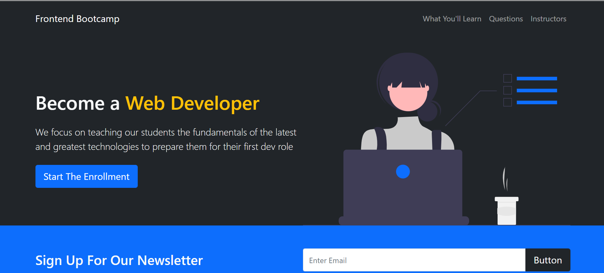
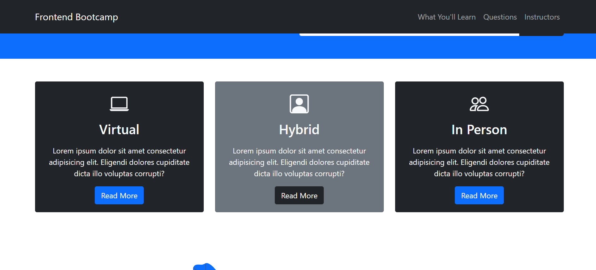
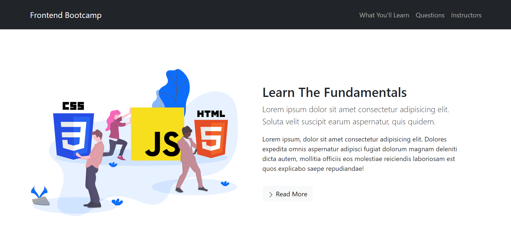
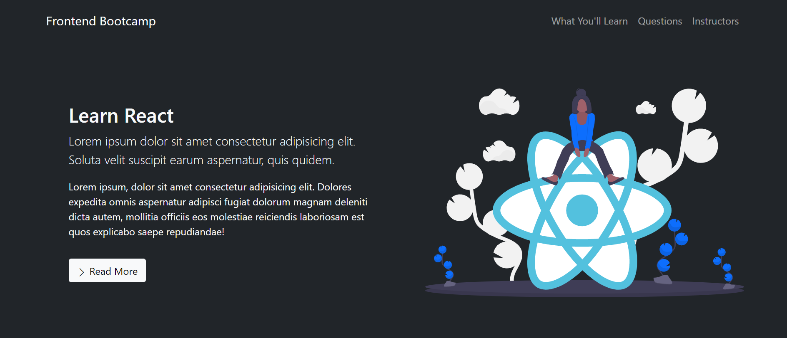
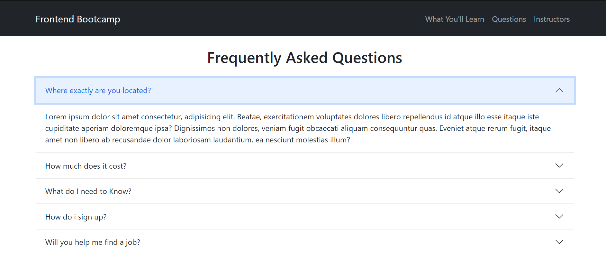
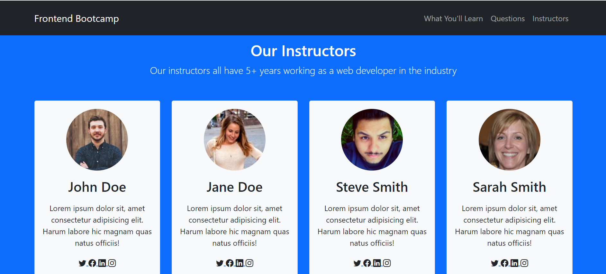

# Introduction
A Frontend Bootcamp Website

# Installation
- git clone https://github.com/BasuGM/frontendBootcampWebsite  
- open in VS Code
- Install Live Server in VS Code
- Run in Live Server

# Tech Stack
- HTML  
- CSS  
- Bootstrap  

# Screens

  

